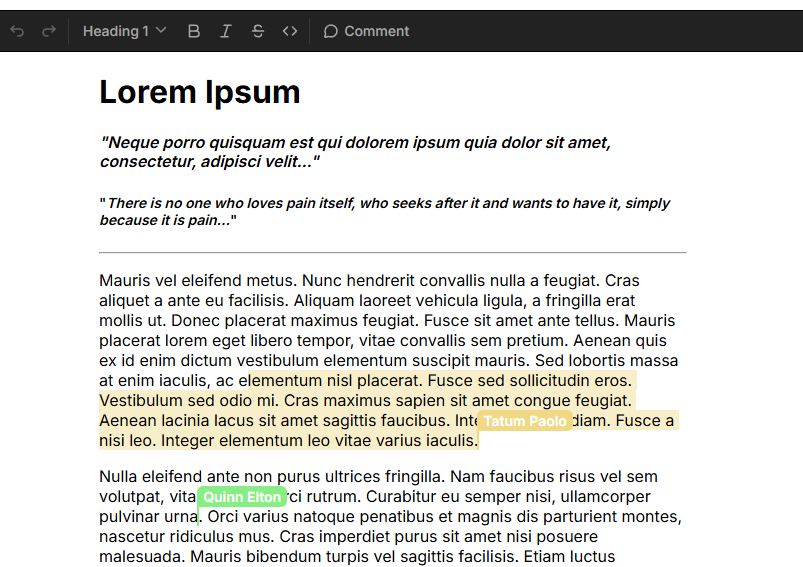

This example shows how to build a collaborative text editor with [Liveblocks](https://liveblocks.io), [TipTap](https://tiptap.dev/), and [Next.js](https://nextjs.org/).

As users edit the document, changes will be automatically persisted and synced—allowing for an editor that updates in real-time across clients. Users will also be able to see who see each other’s cursors in the document.

### Getting started

- Install all dependencies with `npm install`
- Create an account on [liveblocks.io](https://liveblocks.io/dashboard)
- Copy your **secret** key from the [dashboard](https://liveblocks.io/dashboard/apikeys)
- Create an `.env.local` file and add your **secret** key as the `LIVEBLOCKS_SECRET_KEY` environment variable
- Run `npm run dev` and go to [http://localhost:3000](http://localhost:3000)

#### A more advanced example -> [Tiptap Advanaced ](https://github.com/liveblocks/liveblocks/tree/main/examples/nextjs-tiptap-advanced)
